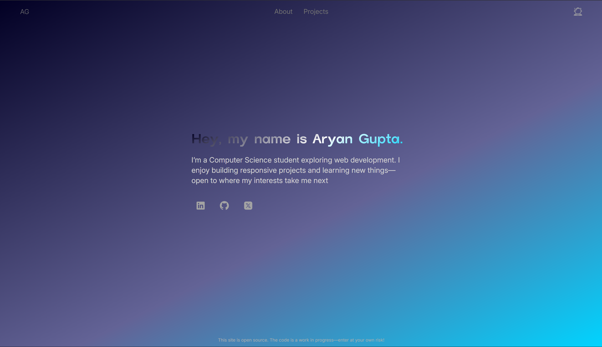

  
   
  
<h1 align="center"> Personal Portfolio Website</h1>
 

A personal website is something I really wanted to build—not just to showcase the projects I've worked on, but also as a space that reflects my learning journey and who I am. It's simple, responsive, and sprinkled with a few personal touches, like custom icons and playful tooltips.

 

## 🛠️ Tech Stack

- **HTML5**
- **CSS3**

## Features

- Clean, minimal design
- Mobile responsive layout
- Personal touches like custom SVG icons and hover tooltips
